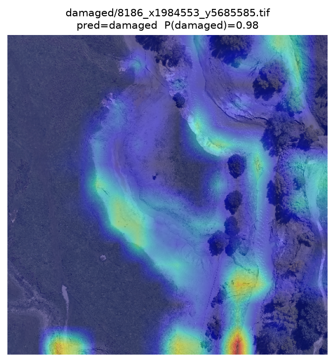
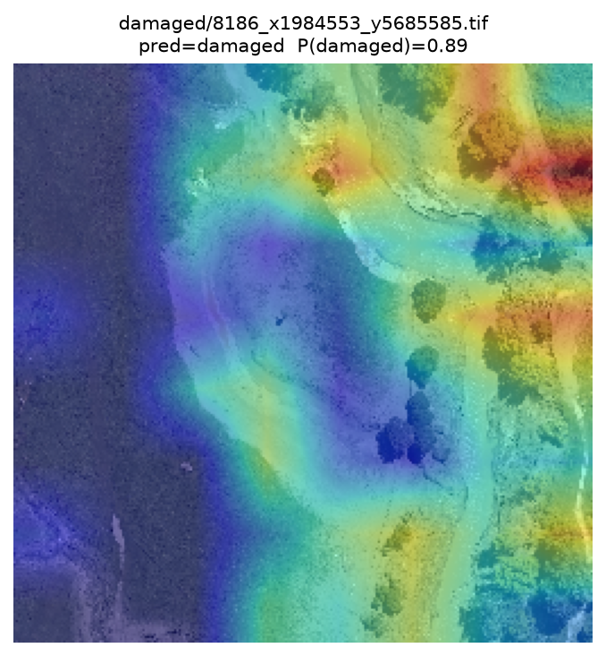
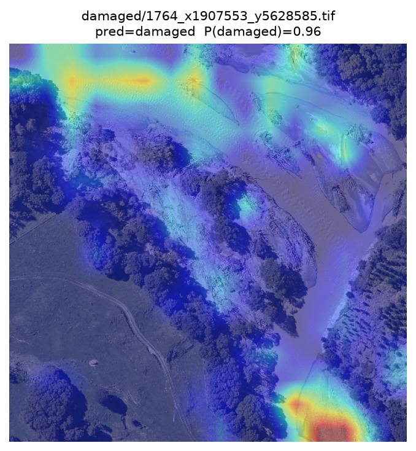
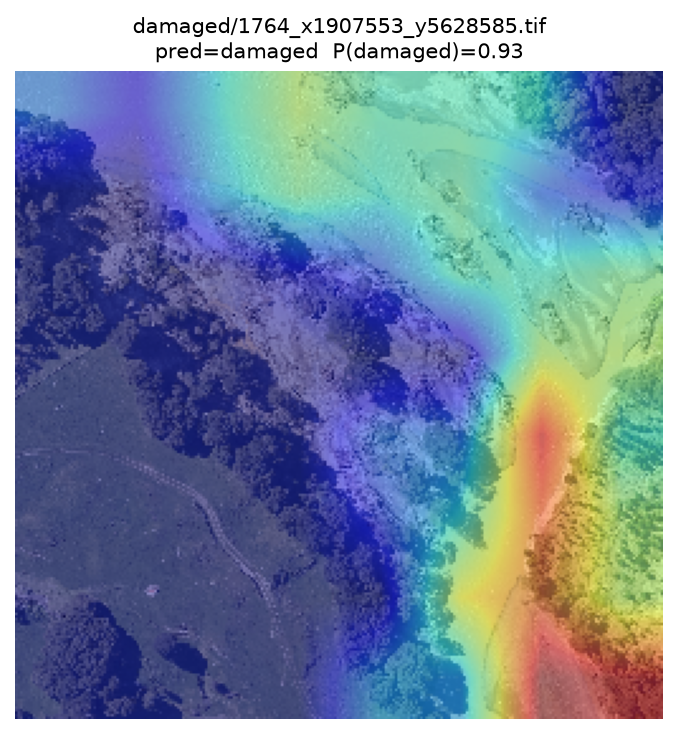
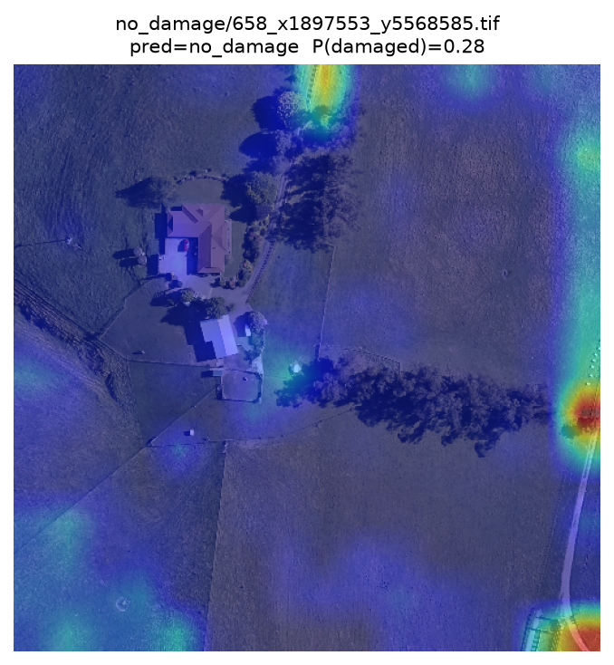
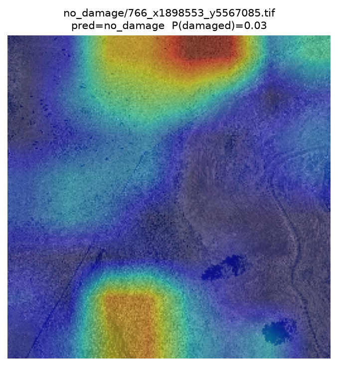
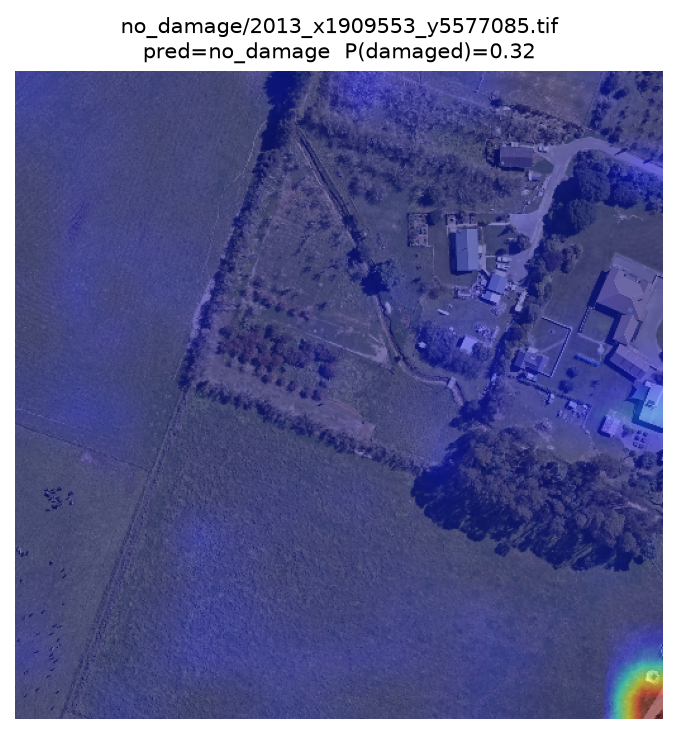
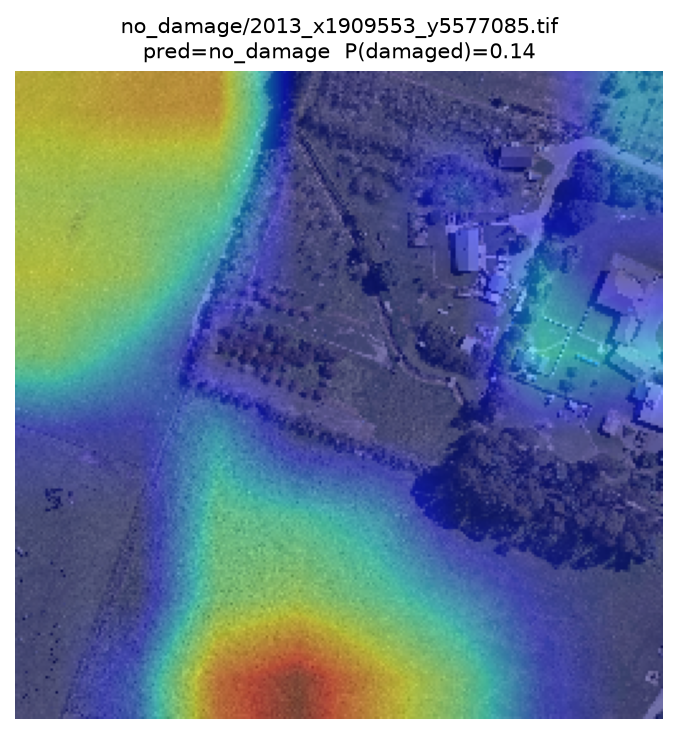
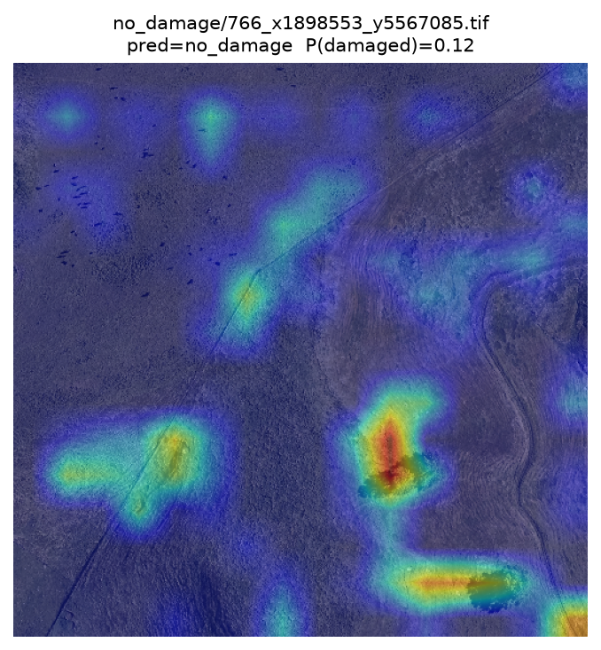
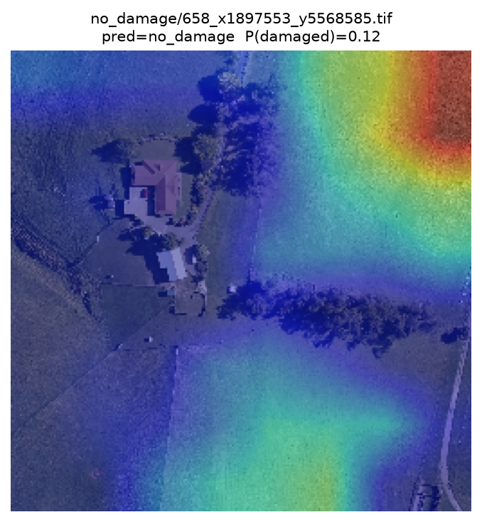

# Label-Efficient Damage Assessment of Non-Building Infrastructure

Detecting cyclone damage to **roads, bridges, and land** from pre/post aerial imagery, using frozen remote-sensing foundation models and knowledge distillation.

Built on imagery of **Cyclone Gabrielle** (New Zealand, February 2023) from Land Information New Zealand (LINZ).

---

## Overview

Most damage-assessment models are trained on **buildings** in **satellite** imagery. Cyclones and floods, though, mostly damage things that are not buildings, and response teams increasingly fly **aerial** surveys at sub-metre resolution. That is a double gap: different target, different sensor.

This project asks two questions:

1. With fewer than 100 labels per class, what is the best way to adapt a pretrained model to this task: supervised transfer from xBD, a frozen foundation-model linear probe, or LoRA fine-tuning?
2. Can the best model be compressed into something small enough to run cheaply, without losing damage recall?

**Short answers.** A frozen Swin-V2-B pretrained on aerial NAIP imagery is the strongest in-region model (0.9767 accuracy, 0.9583 recall, 0.9943 AUC). Distilling it into a DenseNet-121 keeps the same damage recall (0.9583) at about 11x fewer parameters, and transfers better to an unseen region.

---

## Dataset

| | |
|---|---|
| Source | Land Information New Zealand Data services (CC BY 4.0) |
| Pre-event | Hawke's Bay rural aerial, 2021-2022, 0.3 m/px |
| Post-event | Cyclone Gabrielle, 2023, 0.1 m/px |
| Tiling | 500 m x 500 m grid, WMTS streaming (QGIS + GDAL/rasterio); 250 m x 250 m central crops for the labelled set |
| Unlabelled corpus | ~6,500 pre/post pairs |
| Label | Binary: `damaged` vs `no_damage` |

Hand-labelled subset used for fine-tuning and testing:

| Split | Damaged | No damage | Total |
|---|---|---|---|
| Train | 55 | 36 | 91 |
| Hold | 33 | 59 | 92 |
| CV pool (train + hold) | 88 | 95 | 183 |
| Test | 48 | 81 | 129 |

### Examples

**Damaged cases**

| Post (2023) | Pre (2021-22) | Grad-CAM: DenseNet121<br>(250 m x 250 m crop) | Grad-CAM: Swin-V2 NAIP<br>(250 m x 250 m crop) |
|:---:|:---:|:---:|:---:|
|  |  |  |  |
|  |  |  |  |
|  |  |  |  |

**No-damage cases**

| Post (2023) | Pre (2021-22) | Grad-CAM: DenseNet121<br>(250 m x 250 m crop) | Grad-CAM: Swin-V2 NAIP<br>(250 m x 250 m crop) |
|:---:|:---:|:---:|:---:|
|  |  |  |  |
|  |  |  |  |
|  |  |  |  |

<!-- Put the tiles and Grad-CAM overlays in docs/examples/ with the names above.
     Two Grad-CAM columns per row: DenseNet121 (student) and Swin-V2 NAIP (teacher),
     both on the 250 m x 250 m crop. They show where each model looks: on the real
     damage for the damaged rows, and quiet for the no-damage rows. -->

---

## Method

Each sample is a co-registered pre/post tile pair. The two RGB images are stacked into a single **6-channel input**, so a standard encoder sees appearance and change at once. Only the first layer is changed, to accept 6 channels instead of 3.

Two backbone families are compared, adapted in different ways:

| Strategy | Pretraining | What is trained | Why |
|---|---|---|---|
| Supervised transfer | ImageNet (natural) | Backbone via xBD + LoRA | Large domain gap, features need updating |
| **Linear probe** | Aerial foundation model | 6-ch stem + linear head | Features already aligned; freezing avoids overfitting |
| LoRA | Aerial foundation model | Stem + head + adapters | Extra capacity risks overfitting on ~180 labels |

The best frozen model (teacher) is then distilled into a compact DenseNet-121 (student), which keeps most of the accuracy at a fraction of the cost.

A useful pattern from the results: a model pretrained on **aerial** imagery (NAIP) clearly beats the same model pretrained on **satellite** imagery (Sentinel-2). Matching the pretraining sensor to the target sensor matters as much as model size.

---

## Results

All numbers are on the held-out test set (129 pairs), after stratified 5-fold cross-validation.

### Foundation-model linear probe (frozen backbones)

| Backbone | Acc. | Prec. | Rec. | F1 | AUC | Params (M) |
|---|---|---|---|---|---|---|
| resnet18_sentinel2 | 0.8915 | 0.9722 | 0.7292 | 0.8333 | 0.9825 | 11.7 |
| resnet50_sentinel2 | 0.9147 | 0.9744 | 0.7917 | 0.8736 | 0.9702 | 25.6 |
| vit_small_sentinel2 | 0.9225 | 0.9318 | 0.8542 | 0.8913 | 0.9792 | 22.0 |
| swin_v2_t_satlas_s2 | 0.9147 | 0.9512 | 0.8125 | 0.8764 | 0.9805 | 28.4 |
| swin_v2_b_satlas_s2 | 0.9380 | 0.9348 | 0.8958 | 0.9149 | 0.9771 | 87.9 |
| resnet50_fmow_rgb | 0.9457 | 0.9767 | 0.8750 | 0.9231 | 0.9905 | 25.6 |
| **swin_v2_b_satlas_naip** | **0.9767** | **0.9787** | **0.9583** | **0.9684** | **0.9943** | 87.9 |

### Distillation and efficiency

| Model | Params (M) | GFLOPs | Acc. | Rec. | F1 | AUC |
|---|---|---|---|---|---|---|
| Swin-V2-B NAIP (teacher) | 87.9 | ~15.4 | 0.9767 | 0.9583 | 0.9684 | 0.9943 |
| DenseNet121 (student) | 8.0 | ~2.9 | 0.9457 | 0.8750 | 0.9231 | 0.9928 |
| **DenseNet121 + KD** | **8.0** | **~2.9** | **0.9535** | **0.9583** | **0.9388** | 0.9905 |

### Cross-region test (Gisborne, unseen)

| Model | Acc. | Prec. | Rec. | F1 |
|---|---|---|---|---|
| DenseNet121 + KD (student) | 0.8800 | 0.7692 | 0.8696 | 0.8163 |
| Swin-V2-B NAIP (probe) | 0.8267 | 0.6389 | 0.9665 | 0.7797 |

On the new region the distilled student stays balanced, while the frozen Swin probe keeps its recall but loses precision (more false alarms). Freezing the backbone protects the features, but the linear head can still overfit to the training region, and distillation seems to help the student generalise.

---

## Notes

These results are preliminary. The test sets are small (129 in-region, 75 external), all runs use a single seed, and the Gisborne set changes both region and resolution, so treat differences between the top models as provisional.

---

## Citation

```bibtex
@inproceedings{danansooriya2027label,
  title     = {Label-Efficient Cross-Domain Damage Assessment of Non-Building
               Infrastructure: A Benchmark on Cyclone Gabrielle Aerial Imagery},
  author    = {Danansooriya, Chanuka and Ranasinghe, Malintha and
               Prasanna, Raj and Attanayake, Chamodya},
  year      = {2027}
}
```

---

## Acknowledgments

This research is supported by the **Natural Hazards Commission Toka Tu Ake**, New Zealand.

Aerial imagery (c) **Land Information New Zealand (LINZ)**, licensed under [CC BY 4.0](https://creativecommons.org/licenses/by/4.0/).

Pretrained backbones from [TorchGeo](https://github.com/microsoft/torchgeo) and [SatlasPretrain](https://github.com/allenai/satlas).
# Label-Efficient Damage Assessment of Non-Building Infrastructure

Detecting cyclone damage to **roads, bridges, and land** from pre/post aerial imagery, using frozen remote-sensing foundation models and knowledge distillation.

Built on imagery of **Cyclone Gabrielle** (New Zealand, February 2023) from Land Information New Zealand (LINZ).

---

## Overview

Most damage-assessment models are trained on **buildings** in **satellite** imagery. Cyclones and floods, though, mostly damage things that are not buildings, and response teams increasingly fly **aerial** surveys at sub-metre resolution. That is a double gap: different target, different sensor.

This project asks two questions:

1. With fewer than 100 labels per class, what is the best way to adapt a pretrained model to this task: supervised transfer from xBD, a frozen foundation-model linear probe, or LoRA fine-tuning?
2. Can the best model be compressed into something small enough to run cheaply, without losing damage recall?

**Short answers.** A frozen Swin-V2-B pretrained on aerial NAIP imagery is the strongest in-region model (0.9767 accuracy, 0.9583 recall, 0.9943 AUC). Distilling it into a DenseNet-121 keeps the same damage recall (0.9583) at about 11x fewer parameters, and transfers better to an unseen region.

---

## Dataset

| | |
|---|---|
| Source | LINZ open aerial imagery (CC BY 4.0) |
| Pre-event | Hawke's Bay rural aerial, 2021-2022, 0.3 m/px |
| Post-event | Cyclone Gabrielle, 2023, 0.1 m/px |
| Tiling | 500 m x 500 m grid, WMTS streaming (QGIS + GDAL/rasterio); 250 m x 250 m central crops for the labelled set |
| Unlabelled corpus | ~6,500 pre/post pairs |
| Label | Binary: `damaged` vs `no_damage` |

Hand-labelled subset used for fine-tuning and testing:

| Split | Damaged | No damage | Total |
|---|---|---|---|
| Train | 55 | 36 | 91 |
| Hold | 33 | 59 | 92 |
| CV pool (train + hold) | 88 | 95 | 183 |
| Test | 48 | 81 | 129 |

### Examples

**Damaged cases**

| Post (2023) | Pre (2021-22) | Grad-CAM: DenseNet121<br>(250 m x 250 m crop) | Grad-CAM: Swin-V2 NAIP<br>(250 m x 250 m crop) |
|:---:|:---:|:---:|:---:|
|  |  |  |  |
|  |  |  |  |
|  |  |  |  |

**No-damage cases**

| Post (2023) | Pre (2021-22) | Grad-CAM: DenseNet121<br>(250 m x 250 m crop) | Grad-CAM: Swin-V2 NAIP<br>(250 m x 250 m crop) |
|:---:|:---:|:---:|:---:|
|  |  |  |  |
|  |  |  |  |
|  |  |  |  |

<!-- Put the tiles and Grad-CAM overlays in docs/examples/ with the names above.
     Two Grad-CAM columns per row: DenseNet121 (student) and Swin-V2 NAIP (teacher),
     both on the 250 m x 250 m crop. They show where each model looks: on the real
     damage for the damaged rows, and quiet for the no-damage rows. -->

---

## Method

Each sample is a co-registered pre/post tile pair. The two RGB images are stacked into a single **6-channel input**, so a standard encoder sees appearance and change at once. Only the first layer is changed, to accept 6 channels instead of 3.

Two backbone families are compared, adapted in different ways:

| Strategy | Pretraining | What is trained | Why |
|---|---|---|---|
| Supervised transfer | ImageNet (natural) | Backbone via xBD + LoRA | Large domain gap, features need updating |
| **Linear probe** | Aerial foundation model | 6-ch stem + linear head | Features already aligned; freezing avoids overfitting |
| LoRA | Aerial foundation model | Stem + head + adapters | Extra capacity risks overfitting on ~180 labels |

The best frozen model (teacher) is then distilled into a compact DenseNet-121 (student), which keeps most of the accuracy at a fraction of the cost.

A useful pattern from the results: a model pretrained on **aerial** imagery (NAIP) clearly beats the same model pretrained on **satellite** imagery (Sentinel-2). Matching the pretraining sensor to the target sensor matters as much as model size.

---

## Results

All numbers are on the held-out test set (129 pairs), after stratified 5-fold cross-validation.

### Foundation-model linear probe (frozen backbones)

| Backbone | Acc. | Prec. | Rec. | F1 | AUC | Params (M) |
|---|---|---|---|---|---|---|
| resnet18_sentinel2 | 0.8915 | 0.9722 | 0.7292 | 0.8333 | 0.9825 | 11.7 |
| resnet50_sentinel2 | 0.9147 | 0.9744 | 0.7917 | 0.8736 | 0.9702 | 25.6 |
| vit_small_sentinel2 | 0.9225 | 0.9318 | 0.8542 | 0.8913 | 0.9792 | 22.0 |
| swin_v2_t_satlas_s2 | 0.9147 | 0.9512 | 0.8125 | 0.8764 | 0.9805 | 28.4 |
| swin_v2_b_satlas_s2 | 0.9380 | 0.9348 | 0.8958 | 0.9149 | 0.9771 | 87.9 |
| resnet50_fmow_rgb | 0.9457 | 0.9767 | 0.8750 | 0.9231 | 0.9905 | 25.6 |
| **swin_v2_b_satlas_naip** | **0.9767** | **0.9787** | **0.9583** | **0.9684** | **0.9943** | 87.9 |

### Distillation and efficiency

| Model | Params (M) | GFLOPs | Acc. | Rec. | F1 | AUC |
|---|---|---|---|---|---|---|
| Swin-V2-B NAIP (teacher) | 87.9 | ~15.4 | 0.9767 | 0.9583 | 0.9684 | 0.9943 |
| DenseNet121 (student) | 8.0 | ~2.9 | 0.9457 | 0.8750 | 0.9231 | 0.9928 |
| **DenseNet121 + KD** | **8.0** | **~2.9** | **0.9535** | **0.9583** | **0.9388** | 0.9905 |

### Cross-region test (Gisborne, unseen)

| Model | Acc. | Prec. | Rec. | F1 |
|---|---|---|---|---|
| DenseNet121 + KD (student) | 0.8800 | 0.7692 | 0.8696 | 0.8163 |
| Swin-V2-B NAIP (probe) | 0.8267 | 0.6389 | 0.9665 | 0.7797 |

On the new region the distilled student stays balanced, while the frozen Swin probe keeps its recall but loses precision (more false alarms). Freezing the backbone protects the features, but the linear head can still overfit to the training region, and distillation seems to help the student generalise.

---

## Notes

These results are preliminary. The test sets are small (129 in-region, 75 external), all runs use a single seed, and the Gisborne set changes both region and resolution, so treat differences between the top models as provisional.

---

## Citation

```bibtex
@inproceedings{danansooriya2027label,
  title     = {Label-Efficient Cross-Domain Damage Assessment of Non-Building
               Infrastructure: A Benchmark on Cyclone Gabrielle Aerial Imagery},
  author    = {Danansooriya, Chanuka and Ranasinghe, Malintha and
               Prasanna, Raj and Attanayake, Chamodya},
  year      = {2027}
}
```

---

## Acknowledgments

This research is supported by the **Natural Hazards Commission Toka Tu Ake**, New Zealand.

Aerial imagery (c) **Land Information New Zealand (LINZ)**, licensed under [CC BY 4.0](https://creativecommons.org/licenses/by/4.0/).

Pretrained backbones from [TorchGeo](https://github.com/microsoft/torchgeo) and [SatlasPretrain](https://github.com/allenai/satlas).